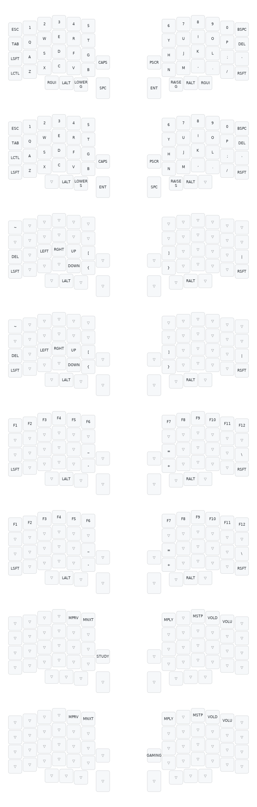

# Lily 58 Firmware

Related files for my Boardsource Lulu QMK firmware

**Note:** visualizer does not show any overrides that I have configured

Compilation: `qmk compile -kb boardsource/lulu/avr -km <yourKeymap> -e CONVERT_TO=blok` 

